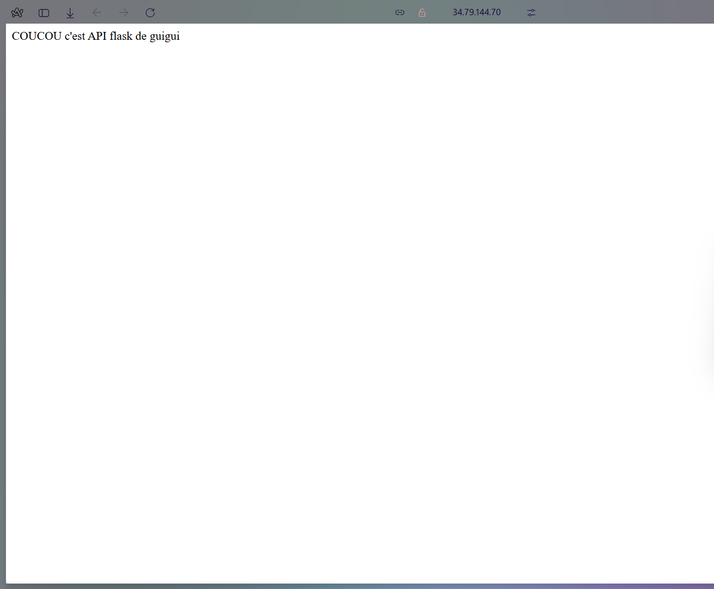

# 🚀 Projet DevOps GCP — Flask, Docker, Terraform, GKE, CI/CD

Projet complet de déploiement d'une application Flask sur Google Cloud Platform avec Kubernetes, Infrastructure as Code (Terraform) et CI/CD (GitHub Actions).

---

## 📋 Table des matières

1. [Structure des Fichiers](#1-structure-des-fichiers)
2. [Étape 1 : Configuration GCP Initiale](#2-étape-1--configuration-gcp-initiale)
3. [Étape 2 : Déployer l'Infrastructure avec Terraform](#3-étape-2--déployer-linfrastructure-avec-terraform-iam)
4. [Étape 3 : Build & Test Docker Local](#4-étape-3--build--test-docker-local)
5. [Étape 4 : Push vers Artifact Registry](#5-étape-4--push-vers-artifact-registry)
6. [Étape 5 : Créer le Cluster GKE](#6-étape-5--créer-le-cluster-gke-kubernetes)
7. [Étape 6 : Déployer sur Kubernetes](#7-étape-6--déployer-sur-kubernetes)
8. [Étape 7 : Configurer le Pipeline CI/CD](#8-étape-7--configurer-le-pipeline-cicd-github-actions)
9. [Nettoyage](#9-nettoyage)

---

## 1. Structure des Fichiers

```
flask-gcp-project/
├── app/
│   ├── app.py              
│   ├── Dockerfile          
│   └── requirements.txt    
├── k8s/
│   ├── deployment.yaml     
│   └── service.yaml        
├── terraform/
│   ├── main.tf             
│   ├── variables.tf        
│   ├── outputs.tf          
│   └── terraform.tfvars    
├── .github/
│   └── workflows/
│       └── deploy.yml      
├── .gitignore
└── README.md
```

---

## 2. Étape 1 : Configuration GCP Initiale

### Commandes exécutées

```bash

gcloud auth login

gcloud config set project tpfinal2026

gcloud auth application-default set-quota-project tpfinal2026

gcloud services enable container.googleapis.com
gcloud services enable artifactregistry.googleapis.com
gcloud services enable iam.googleapis.com
```

---

## 3. Étape 2 : Déployer l'Infrastructure avec Terraform (IAM)

### Fichier `terraform/main.tf`

```hcl
terraform {
  required_version = ">= 1.0.0"
  
  required_providers {
    google = {
      source  = "hashicorp/google"
      version = "~> 5.0"
    }
  }
}

provider "google" {
  project = var.project_id
  region  = var.region
}

resource "google_artifact_registry_repository" "flask_repo" {
  location      = var.region
  repository_id = var.artifact_repo_name
  description   = "Docker repository for Flask application"
  format        = "DOCKER"
}

resource "google_service_account" "gke_sa" {
  account_id   = "gke-service-account"
  display_name = "Service Account for GKE Workloads"
  description  = "Service account used by GKE pods"
}

# Service Account pour CI/CD (GitHub Actions)
resource "google_service_account" "cicd_sa" {
  account_id   = "cicd-service-account"
  display_name = "Service Account for CI/CD Pipeline"
  description  = "Service account used by GitHub Actions"
}

resource "google_project_iam_member" "gke_container_admin" {
  project = var.project_id
  role    = "roles/container.admin"
  member  = "serviceAccount:${google_service_account.gke_sa.email}"
}

resource "google_project_iam_member" "gke_artifact_reader" {
  project = var.project_id
  role    = "roles/artifactregistry.reader"
  member  = "serviceAccount:${google_service_account.gke_sa.email}"
}

resource "google_project_iam_member" "cicd_container_developer" {
  project = var.project_id
  role    = "roles/container.developer"
  member  = "serviceAccount:${google_service_account.cicd_sa.email}"
}

resource "google_project_iam_member" "cicd_artifact_writer" {
  project = var.project_id
  role    = "roles/artifactregistry.writer"
  member  = "serviceAccount:${google_service_account.cicd_sa.email}"
}

resource "google_project_iam_member" "cicd_storage_admin" {
  project = var.project_id
  role    = "roles/storage.admin"
  member  = "serviceAccount:${google_service_account.cicd_sa.email}"
}

resource "google_project_service" "container_api" {
  service            = "container.googleapis.com"
  disable_on_destroy = false
}

resource "google_project_service" "artifactregistry_api" {
  service            = "artifactregistry.googleapis.com"
  disable_on_destroy = false
}

resource "google_project_service" "iam_api" {
  service            = "iam.googleapis.com"
  disable_on_destroy = false
}
```

### Fichier `terraform/variables.tf`

```hcl
variable "project_id" {
  description = "GCP Project ID"
  type        = string
}

variable "region" {
  description = "GCP region for resources"
  type        = string
  default     = "europe-west1"
}

variable "zone" {
  description = "GCP zone for GKE cluster"
  type        = string
  default     = "europe-west1-b"
}

variable "artifact_repo_name" {
  description = "Name of the Artifact Registry repository"
  type        = string
  default     = "flask-repo"
}

variable "cluster_name" {
  description = "Name of the GKE cluster"
  type        = string
  default     = "flask-cluster"
}
```

### Fichier `terraform/outputs.tf`

```hcl
output "gke_service_account_email" {
  description = "Email of the GKE service account"
  value       = google_service_account.gke_sa.email
}

output "cicd_service_account_email" {
  description = "Email of the CI/CD service account"
  value       = google_service_account.cicd_sa.email
}

output "artifact_registry_url" {
  description = "URL of the Artifact Registry repository"
  value       = "${var.region}-docker.pkg.dev/${var.project_id}/${google_artifact_registry_repository.flask_repo.repository_id}"
}
```

### Fichier `terraform/terraform.tfvars`

```hcl
project_id         = "tpfinal2026"
region             = "europe-west1"
zone               = "europe-west1-b"
artifact_repo_name = "flask-repo"
cluster_name       = "flask-cluster"
```

### Commandes exécutées

```bash

cd terraform

copy terraform.tfvars.example terraform.tfvars


terraform init

terraform plan

terraform apply

```

### Ressources créées par Terraform

- ✅ Service Account `gke-service-account`
- ✅ Service Account `cicd-service-account`
- ✅ Repository Artifact Registry `flask-repo`
- ✅ Rôles IAM (container.admin, artifactregistry.reader, container.developer, artifactregistry.writer, storage.admin)
- ✅ APIs activées (container, artifactregistry, iam)

---

## 4. Étape 3 : Build & Test Docker Local

### Fichier `app/app.py`

```python
from flask import Flask, jsonify

app = Flask(__name__)

@app.route('/')
def home():
    return "Hello from Flask deployed on Google Cloud!"

@app.route('/health')
def health():
    """Health check endpoint for Kubernetes"""
    return jsonify({"status": "healthy"}), 200

@app.route('/ready')
def ready():
    """Readiness check endpoint for Kubernetes"""
    return jsonify({"status": "ready"}), 200

if __name__ == "__main__":
    app.run(host='0.0.0.0', port=8080)
```

### Fichier `app/requirements.txt`

```
flask==3.0.0
gunicorn==21.2.0
```

### Fichier `app/Dockerfile`

```dockerfile
FROM python:3.11-slim

LABEL maintainer="DevOps Project"
LABEL description="Flask application for GCP deployment"

ENV PYTHONDONTWRITEBYTECODE=1
ENV PYTHONUNBUFFERED=1

RUN useradd --create-home --shell /bin/bash appuser

WORKDIR /app

COPY requirements.txt .
RUN pip install --no-cache-dir -r requirements.txt

COPY . .

RUN chown -R appuser:appuser /app

USER appuser

EXPOSE 8080

CMD ["gunicorn", "--bind", "0.0.0.0:8080", "--workers", "2", "--threads", "4", "app:app"]
```

### Commandes exécutées

```bash
cd app

docker build -t flask-app .

docker run -p 8080:8080 flask-app

```

---

## 5. Étape 4 : Push vers Artifact Registry

### Commandes exécutées

```bash
gcloud auth configure-docker europe-west1-docker.pkg.dev

docker tag flask-app europe-west1-docker.pkg.dev/tpfinal2026/flask-repo/flask-app:latest

docker push europe-west1-docker.pkg.dev/tpfinal2026/flask-repo/flask-app:latest
```

---

## 6. Étape 5 : Créer le Cluster GKE (Kubernetes)

### Commandes exécutées

```bash
gcloud container clusters create flask-cluster --zone=europe-west1-b --num-nodes=2 --machine-type=e2-small

gcloud container clusters get-credentials flask-cluster --zone=europe-west1-b
```

---

## 7. Étape 6 : Déployer sur Kubernetes

### Fichier `k8s/deployment.yaml`

```yaml
apiVersion: apps/v1
kind: Deployment
metadata:
  name: flask-deployment
  labels:
    app: flask
spec:
  replicas: 2
  selector:
    matchLabels:
      app: flask
  template:
    metadata:
      labels:
        app: flask
    spec:
      containers:
      - name: flask
        image: europe-west1-docker.pkg.dev/tpfinal2026/flask-repo/flask-app:latest
        ports:
        - containerPort: 8080
        livenessProbe:
          httpGet:
            path: /health
            port: 8080
          initialDelaySeconds: 10
          periodSeconds: 10
          timeoutSeconds: 5
          failureThreshold: 3
        readinessProbe:
          httpGet:
            path: /ready
            port: 8080
          initialDelaySeconds: 5
          periodSeconds: 5
          timeoutSeconds: 3
          failureThreshold: 3
        resources:
          requests:
            memory: "128Mi"
            cpu: "100m"
          limits:
            memory: "256Mi"
            cpu: "500m"
        env:
        - name: FLASK_ENV
          value: "production"
```

### Fichier `k8s/service.yaml`

```yaml
apiVersion: v1
kind: Service
metadata:
  name: flask-service
  labels:
    app: flask
spec:
  selector:
    app: flask
  ports:
    - protocol: TCP
      port: 80
      targetPort: 8080
  type: LoadBalancer
```

### Commandes exécutées

```bash
cd k8s

(Get-Content deployment.yaml) -replace 'PROJECT_ID', 'tpfinal2026' | Set-Content deployment.yaml

kubectl apply -f deployment.yaml

kubectl apply -f service.yaml

kubectl get pods

kubectl get services
```

---

## 8. Étape 7 : Configurer le Pipeline CI/CD (GitHub Actions)

### Fichier `.github/workflows/deploy.yml`

```yaml
name: Build and Deploy Flask App to GKE

on:
  push:
    branches: [ main ]
  pull_request:
    branches: [ main ]

env:
  PROJECT_ID: ${{ secrets.GCP_PROJECT_ID }}
  REGION: europe-west1
  ZONE: europe-west1-b
  CLUSTER_NAME: flask-cluster
  REPO_NAME: flask-repo
  IMAGE_NAME: flask-app

jobs:
  build-and-push:
    name: Build and Push Docker Image
    runs-on: ubuntu-latest
    
    steps:
    - name: Checkout code
      uses: actions/checkout@v4

    - name: Authenticate to Google Cloud
      uses: google-github-actions/auth@v2
      with:
        credentials_json: ${{ secrets.GCP_SA_KEY }}

    - name: Set up Cloud SDK
      uses: google-github-actions/setup-gcloud@v2
      with:
        project_id: ${{ secrets.GCP_PROJECT_ID }}

    - name: Configure Docker authentication
      run: gcloud auth configure-docker ${{ env.REGION }}-docker.pkg.dev --quiet

    - name: Build Docker image
      run: |
        docker build -t ${{ env.REGION }}-docker.pkg.dev/${{ env.PROJECT_ID }}/${{ env.REPO_NAME }}/${{ env.IMAGE_NAME }}:${{ github.sha }} \
                     -t ${{ env.REGION }}-docker.pkg.dev/${{ env.PROJECT_ID }}/${{ env.REPO_NAME }}/${{ env.IMAGE_NAME }}:latest \
                     ./app

    - name: Push Docker image to Artifact Registry
      run: |
        docker push ${{ env.REGION }}-docker.pkg.dev/${{ env.PROJECT_ID }}/${{ env.REPO_NAME }}/${{ env.IMAGE_NAME }}:${{ github.sha }}
        docker push ${{ env.REGION }}-docker.pkg.dev/${{ env.PROJECT_ID }}/${{ env.REPO_NAME }}/${{ env.IMAGE_NAME }}:latest

  deploy:
    name: Deploy to GKE
    needs: build-and-push
    runs-on: ubuntu-latest
    if: github.ref == 'refs/heads/main' && github.event_name == 'push'
    
    steps:
    - name: Checkout code
      uses: actions/checkout@v4

    - name: Authenticate to Google Cloud
      uses: google-github-actions/auth@v2
      with:
        credentials_json: ${{ secrets.GCP_SA_KEY }}

    - name: Set up Cloud SDK
      uses: google-github-actions/setup-gcloud@v2
      with:
        project_id: ${{ secrets.GCP_PROJECT_ID }}

    - name: Install gke-gcloud-auth-plugin
      run: |
        gcloud components install gke-gcloud-auth-plugin --quiet

    - name: Get GKE credentials
      run: |
        gcloud container clusters get-credentials ${{ env.CLUSTER_NAME }} --zone ${{ env.ZONE }}

    - name: Update Kubernetes deployment image
      run: |
        kubectl set image deployment/flask-deployment \
          flask=${{ env.REGION }}-docker.pkg.dev/${{ env.PROJECT_ID }}/${{ env.REPO_NAME }}/${{ env.IMAGE_NAME }}:${{ github.sha }}

    - name: Verify deployment
      run: |
        kubectl rollout status deployment/flask-deployment --timeout=120s
```

### Commandes exécutées

```bash
gcloud iam service-accounts keys create key.json --iam-account=cicd-service-account@tpfinal2026.iam.gserviceaccount.com

Get-Content key.json
```

### Configuration GitHub Secrets

1. Aller sur https://github.com/Cilag/flask-gcp-project/settings/secrets/actions
2. Ajouter **New repository secret** :
   - `GCP_PROJECT_ID` = `tpfinal2026`
   - `GCP_SA_KEY` = contenu du fichier `key.json`

### Test du Pipeline

```bash
cd app
notepad app.py

cd ..
git add .
git commit -m "Test CI/CD pipeline"
git push
```
 

---

## 9. Nettoyage

Pour éviter des frais GCP après le projet :

```bash
kubectl delete -f k8s/

gcloud container clusters delete flask-cluster --zone=europe-west1-b

cd terraform
terraform destroy
```
